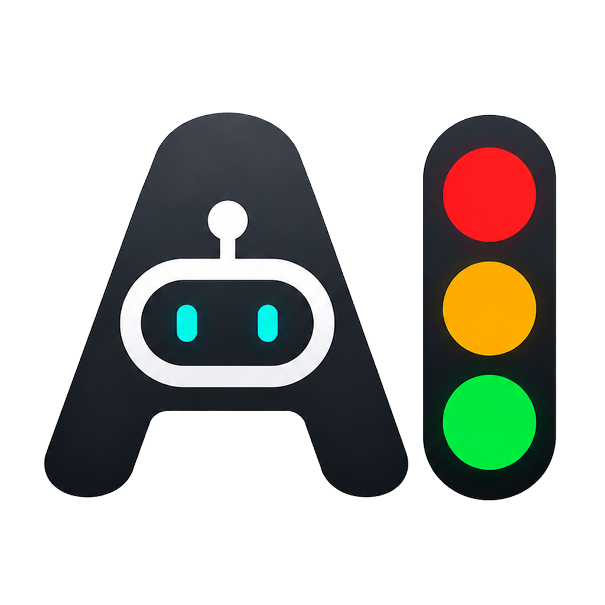

# AgentStatusLight

[English](README_EN.md)

  

AgentStatusLight 是一个本地悬浮状态灯，用红、黄、绿三盏灯提示 Codex 或 Claude 的当前状态。

它适合放在桌面角落：Agent 工作时亮黄灯，需要你处理时亮红灯，完成时亮绿灯。

## 使用 Agent 时的困扰

使用 Codex 或 Claude Code 处理较长任务时，终端经常会在后台运行。你可能需要反复切回窗口，确认它是在工作、已经完成，还是正在等你确认。

AgentStatusLight 把这些状态放到桌面上，用红、黄、绿三盏灯直接提示：红灯表示需要确认，黄灯表示正在工作，绿灯表示刚刚完成。这样不用一直盯着终端，也能及时知道什么时候需要介入。

## 快速使用

1. 下载 `AgentStatusLight.zip`。
2. 解压到桌面、文档等可写入的位置。
3. 双击运行 `AgentStatusLight.exe`。
4. 拖动悬浮灯到你习惯的位置。

首次启动时，悬浮灯会出现在屏幕中间，并保持桌面置顶。拖动后再次启动，会回到上次位置。

> 不建议放到 `C:\Program Files\` 这类需要管理员权限的位置，否则程序可能无法保存设置和状态。

## 状态怎么看

- 红灯：Agent 需要你确认或输入。
- 黄灯：Agent 正在工作。
- 绿灯：Agent 刚刚完成。
- 三灯低亮：当前空闲。

默认横向显示为红、黄、绿；也可以在右键菜单切换为纵向显示。

## 右键菜单

右键悬浮灯可以：

- 切换皮肤：系统、深色、浅色、透明。
- 打开颜色设置。
- 打开通知设置。
- 打开声音设置。
- 开关呼吸灯效果。
- 切换指示灯方向：横向或纵向。
- 打开 Claude Code 状态灯配置。
- 手动切换红灯、黄灯、绿灯。
- 恢复自动判断。
- 查看关于软件和新版本提示。
- 退出程序。

手动切换灯色后，自动判断会暂停；点击 `恢复自动判断` 后回到自动判断。

## 颜色和声音

在 `颜色设置` 里可以自定义四种状态颜色：

- 确认色：红灯。
- 工作色：黄灯。
- 完成色：绿灯。
- 等待色：空闲低亮。

在 `声音设置` 里可以开启声音提示。红灯和绿灯可以分别选择自定义 WAV 文件；黄灯工作中不会播放声音。

## 通知设置

在 `通知设置` 里可以配置 Windows 通知、Bark、PushPlus 和 Telegram。

每个渠道都可以选择是否在红灯确认、绿灯完成时发送通知。默认只在绿灯完成时通知。

在 `通知模板` 里可以修改通知标题和内容，并预览实际效果。模板支持 `{state}`、`{message}`、`{count}`。

通知密钥会保存在程序旁边的 `data` 文件夹里，请不要公开分享这个文件夹。

## 关于软件和更新

右键悬浮灯，点击 `关于软件` 可以查看当前版本和项目地址。

如果检测到新版本，`关于软件` 菜单旁会出现提示，弹窗里也会显示最新版本号。

## Claude Code

如果你只使用 Codex，通常不需要额外配置。

如果要让 Claude Code CLI 也点亮状态灯，右键悬浮灯，点击 `Claude Code` -> `启用状态灯`。配置完成后重启 Claude Code，让状态灯配置生效。

如果不再使用 Claude Code 状态灯，点击 `Claude Code` -> `移除状态灯配置`，软件会从 Claude Code 配置中删除本软件写入的状态通知入口。

手动配置和事件说明见 [Claude Code 状态灯配置](docs/claude-hooks.md)。

## 更多文档

- [Claude Code 状态灯配置](docs/claude-hooks.md)
- [开发和数据说明](docs/development.md)
